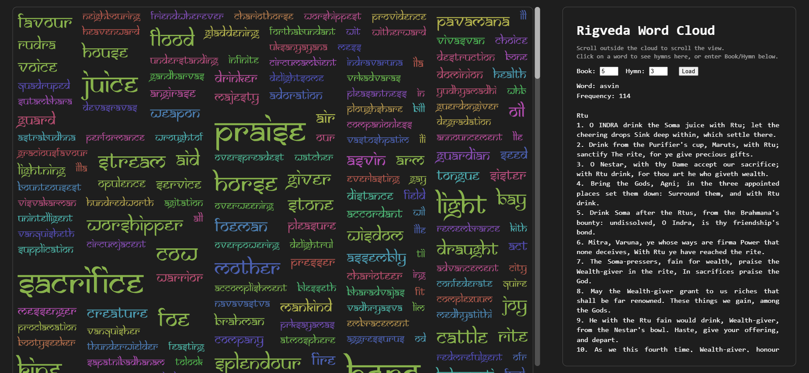

# 🌤 Rigveda Word Cloud Visualization

available at https://rigveda-analysis-production.up.railway.app/

> *"Where words cluster, meaning emerges — may this visualization help illuminate the Rigveda’s vast poetic landscape."*

An interactive **p5.js + FastAPI** application visualizing semantic **word clusters in the Rigveda**.  
Words are grouped based on cosine similarity, sized by frequency, and linked to the hymns where they appear.

---

## 📸 Preview

> *(Add screenshots or GIFs here once deployed)*  
> Example:  
> 

---

## 🧩 Overview

This project creates an **interactive exploration tool** for the Rigveda text:
- 🌀 **Dynamic Word Cloud** – Frequency-scaled, color-coded clusters.
- 🪶 **Semantic Clustering** – Words grouped using cosine similarity.
- 📜 **Hymn Explorer** – Click a word or load specific hymns by book and hymn number.
- 🖱️ **Custom Scroll and Info Panel** – Smooth interactions and responsive layout.

Built with:
- 🎨 **Frontend:** [p5.js](https://p5js.org/) for rendering and interactivity.
- ⚙️ **Backend:** [FastAPI](https://fastapi.tiangolo.com/) for API endpoints.
- 📚 **Data:** Preprocessed Rigveda corpus (`data.json`) containing hierarchical linkage, vocabulary frequencies, and hymns.

---

## 🧠 Architecture

```

rigveda-wordcloud/
│
├── main.py                # FastAPI backend serving clusters & hymns
├── data.json              # Vocabulary, linkage, and hymn text data
│
├── ui/
│   ├── index.html         # Entry point (loads scripts & Samarkan font)
│   ├── p5.min.js          # p5.js core library
│   ├── sketch.js          # Main visualization, scrolling & interactivity
│   ├── rect_cloud.js      # Corner-packing word cloud layout
│   ├── cluster_util.js    # Cluster fetching & color generation
│   ├── info.js            # Hymn info & selection panel logic
│   └── samarkan/          # Sanskrit-style font (SAMAN.TTF)
│
└── README.md

```

---

## 🚀 Features

### ✴️ Word Cloud Visualization
- Font size = frequency of appearance.
- Colors = semantic cluster IDs.
- Smooth incremental layout building.
- Custom scrollbar for large layouts.

### 📚 Hymn Display Panel
- Scrollable text panel for verse details.
- Manual Book/Hymn selector with `Load` button.
- Cached hymns to minimize network calls.

### 🔍 Clustering API
- Hierarchical clustering based on cosine similarity.
- Adjustable similarity threshold (0–1).
- Efficient in-memory caching for repeated queries.

---

## 🧮 Data Schema (`data.json`)

```json
{
  "linkage": [a, b, dist, size, ...],
  "vocab_freq": [["word", freq, ["1-1-1", "1-1-2"]], ...],
  "hymns": { "1-1-1": "Text of verse...", ... }
}
````

* **`linkage`** → Hierarchical clustering linkage array.
* **`vocab_freq`** → Word frequencies + hymn references.
* **`hymns`** → Verse texts keyed by Book-Hymn-Verse ID.

---

## 🧰 Installation & Setup

### 1️⃣ Prerequisites

* Python **3.9+**
* `pip install fastapi uvicorn`
* Browser supporting ES6 JavaScript

### 2️⃣ Clone & Install

```bash
git clone https://github.com/<yourusername>/rigveda-wordcloud.git
cd rigveda-wordcloud
pip install fastapi uvicorn
```

### 3️⃣ Run the FastAPI Server

```bash
python main.py
```

Visit → [http://localhost:8000](http://localhost:8000)

---